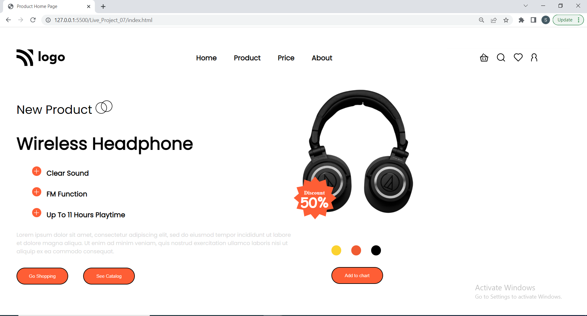

# HeadPhone-Store []

This is basically a one pager online store design template project made in HTML/CSS for an imaginary headphone 🎧  store on the internet.
Hope you like my project !! it works good in laptop screen if you are using desktop please zoom in or out that might work .

## Technologies Used
  - HTML
  - CSS
  - CSS Flex box

## Demo


Clone the project

```bash
  git clone https://github.com/suhas-sm/HeadPhone-Store.git
```

Go to the project directory

```bash
  cd HeadPhone-Store
```

## Features

- Feature pop up
- One Pager Website
- Good Background Image
- Beautifull UI/UX Design
- Image Position and alignment

## What i have learnt By working on this project
1. I have improved my self in positioning of images in a spesific position, also using absolute positioning
2. Improved in designing the project

## Honest Time to finish the project

I had took about 2 hours. This project made me understand how to make an image positioned with respect to other.

## Feedback

If you have any feedback, please reach out to us at melmurissm11@gmail.com
